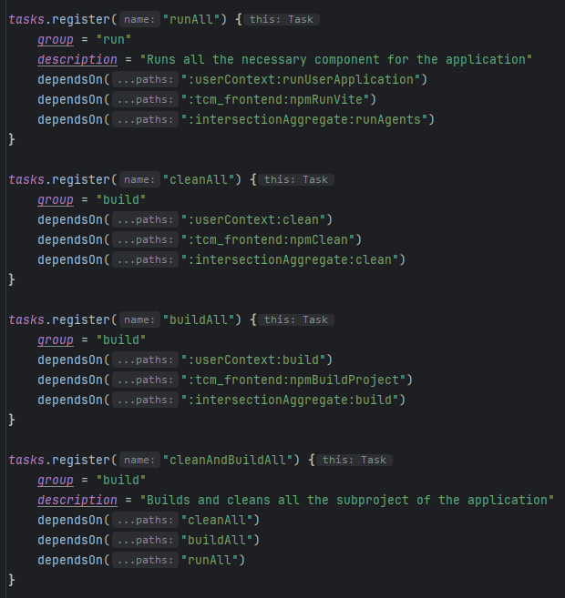
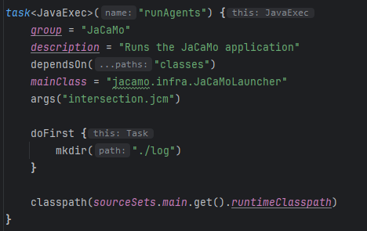
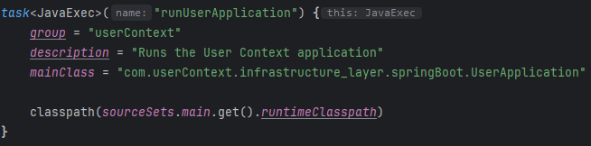
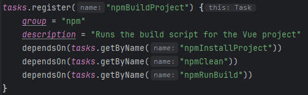

# System Implementation

After analyzing the project requirements, the application was implemented by developing three sub-applications, specifically three microservices, and using a Java-based external SQL database named H2. The sub-applications are defined as follows:

1. **userContext:**
   - A Spring Boot Java project creating REST endpoints for frontend interaction.
   - Utilizes Spring Boot's dialects for various DB interactions.
   - All RPCs to userContext perform queries on the H2 Database.

2. **H2 Database:**
   - Derived from an existing image of a basic H2 Database implementation.
   - Modified for deployment with all necessary components.

3. **intersectionAggregate:**
   - A Multi-Agent System implemented through the JaCaMo library.
   - Leverages JaCaMo-Rest for RPC endpoints to access agent system artifacts.
   - Deployed as a microservice.

4. **tcm_frontend:**
   - A simple Vue application serving as the frontend.
   - When deployed as a container, it includes an internal reverse proxy Nginx server.
   - The Nginx server handles redirecting calls from the Vue app to the right endpoints and resolves CORS Policy issues.

## Continuous Delivery

To automate the initial execution of the system, Gradle (v8.2) was employed, and a series of "build.gradle" files were defined. These files specify how the project is compiled, manage dependencies, and configure other aspects of the build process.

### Implementation Strategy:

The implementation strategy employs a hierarchical structure, with each microservice having its own "build.gradle" file. These microservices are then linked via dependencies to a more generic "build.gradle" file, which defines several tasks within it.

The structure ensures modularization and allows for centralized management of common build tasks. This approach enhances maintainability and streamlines the continuous delivery process.

This is how appears the main and generalized "build.gradle" file.

<p align="center">
  
</p>

In the "build.gradle" file, the following tasks are defined:

1. **runAll:**
   - Executes all the necessary components for the application.

2. **cleanAll:**
   - Cleans the various microservices from the files generated during the compilation phase.

3. **buildAll:**
   - Cleans the various microservices from the files generated during the compilation phase.

4. **cleanAndBuildAll:**
   - Executes all the previously described tasks.

These tasks are designed to streamline the build and deployment process. Running `cleanAndBuildAll` ensures a fresh start by cleaning the microservices and then building them, providing a comprehensive approach to managing the application's lifecycle.

In this next section of the page we want to highlight the best task for each each microservices that has been developed.

<p align="center">
  
</p>

1. **runAgents:**
   - Executes a JaCaMo application using the class `jacamo.infra.JaCaMoLauncher`.
   - Before execution, it creates a log directory.
   - Depends on the "classes" task to ensure correct compilation of source code.
   - The argument "intersection.jcm" is passed, representing the file containing the agent environment.
   - Configures the classpath with necessary dependencies.

 The `runAgents` task, in particular, is crucial for launching JaCaMo applications (agents) with the necessary configurations.

<p align="center">
  
</p>

2. **runUserApplication:**
   - Runs a user context application using the class `com.userContext.infrastructure_layer.springBoot.UserApplication`.
   - Configures the classpath with the necessary dependencies using the runtimeClasspath of the main source set

In the `build.gradle` file of the `tcm_frontend` microservice, the following task is defined for building the Vue project:

<p align="center">
  
</p>

1. **npmBuildProject:**
   - Groups tasks necessary for building a Vue project.
   - Installs dependencies defined in `package.json` using the "npmInstallProject" task.
   - Cleans the project with "npmClean" by removing the "dist" and "build" directories.
   - Runs the build script via "npmRunBuild".

### Conclusion and usage:
So as a final step to actually test the build automation of the application one can simply navigate to the project root and execute the command:

```bash
gradle cleanAndBuildAll
```

[Go Back.](./index.md) [Go Next.](./CI.md)
