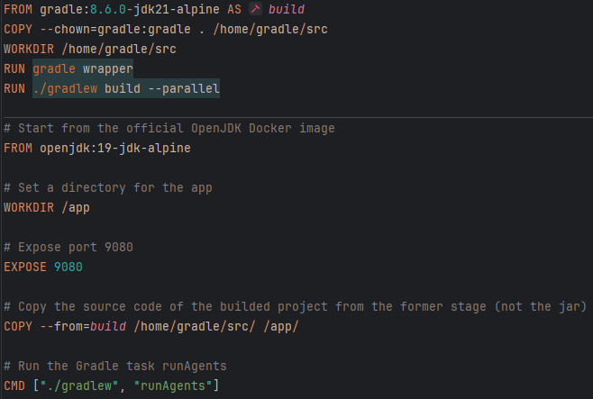
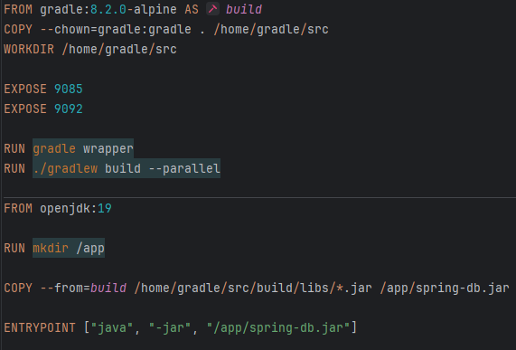
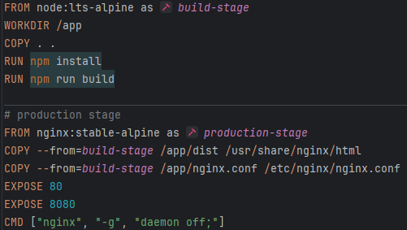
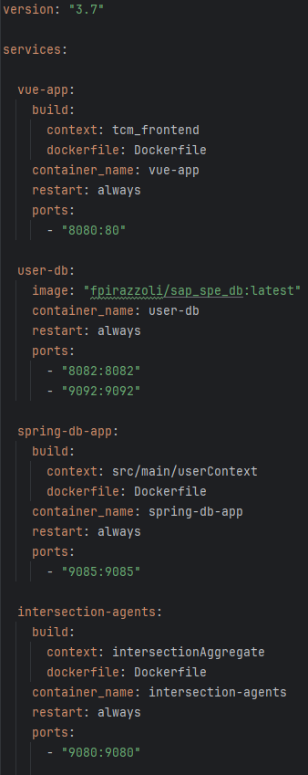

# Containerization using Docker

Containerization, facilitated by Docker, plays a crucial role in efficiently isolating and distributing applications. Docker containers encapsulate everything needed to run an application, ensuring consistency across various environments. This approach simplifies distribution, versioning, and dependency management, enhancing the overall portability of applications.

To containerize the system, a strategy was devised to incorporate a Dockerfile within each microservice, tailoring it to the specific platform used for the service. From JaCaMo for the agents to Spring for the backend and Vue for the frontend, each Dockerfile is crafted accordingly.

### Dockerfiles and Descriptions:

#### 1. **JaCaMo Agents - Dockerfile for Build and Execution Phases:**

  

   - *Build Phase:*
     - Starts from a Gradle image version 8.6.0 with JDK 21 on Alpine Linux.
     - Copies the source code into the directory /home/gradle/src.
     - Sets the working directory.
     - Executes the `gradle wrapper` command.
     - Builds the project with `./gradlew build --parallel`.

   - *Execution Phase:*
     - Uses an OpenJDK image version 19 on Alpine Linux.
     - Sets the working directory for the application to /app.
     - Exposes port 9080.
     - Copies the source code from the build phase.
     - Executes the Gradle task "runAgents" during application startup.

#### 2. **Spring Boot Application - Dockerfile for Build and Deployment Phases:**

  

   - *Build Phase:*
     - Utilizes the base Gradle image version 8.2.0 with Alpine Linux.
     - Copies the project content into the container's directory.
     - Sets the working directory.
     - Exposes ports 9085 and 9092.
     - Configures Gradle Wrapper.
     - Builds the project using `./gradlew build` in parallel mode.

   - *Deployment Phase:*
     - Uses an OpenJDK image version 19.
     - Creates a directory "/app" within the container.
     - Copies the build result from the previous phase into the "/app" directory.
     - Specifies the entrypoint to execute the Spring Boot application upon container launch.

#### 3. **Node.js Application with Nginx - Dockerfile for Build and Production Phases:**

  

   - *Build Phase with Node.js:*
     - Utilizes a Node.js LTS image on Alpine Linux.
     - Sets the working directory to `/app`.
     - Copies the source code into the current directory.
     - Executes the `npm install` command.
     - Executes the `npm run build` command.

   - *Production Phase:*
     - Utilizes a stable Nginx image on Alpine Linux.
     - Copies the build result from the previous phase into the Nginx application directory.
     - Copies the Nginx configuration file.
     - Exposes ports 80 and 8080.
     - Starts Nginx with the command `nginx -g 'daemon off;` during container execution.

### Docker Compose:

The Dockerfiles are orchestrated using Docker-Compose, a tool simplifying the management of multi-container Docker applications. The `compose.yml` file defines the configuration, services, and dependencies of the application.

  

   - Specifies the version of the Compose file format.
   - Defines four distinct services: Vue.js application, user database, Spring application with a database, and a generic application with agents.
   - Configures mapped ports for each service.

Running the command `docker compose up` will initiate the Docker containers, automatically executing `gradlew` within them. This fully automates the system, providing a seamless and consistent deployment environment.

[Go Back.](./index.md) [Go Next.](./CD.md)
