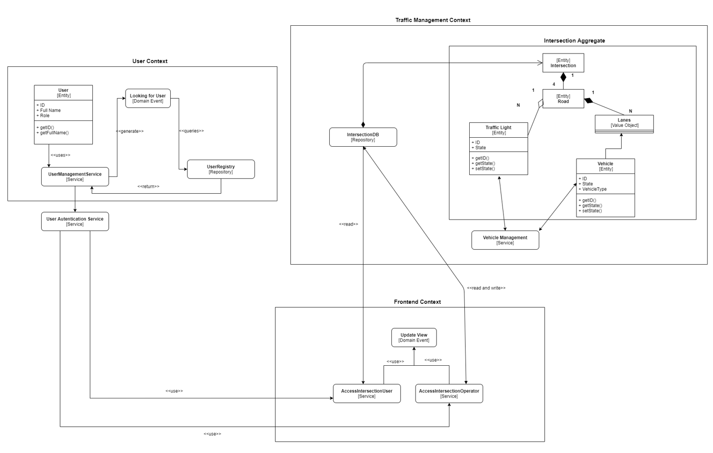
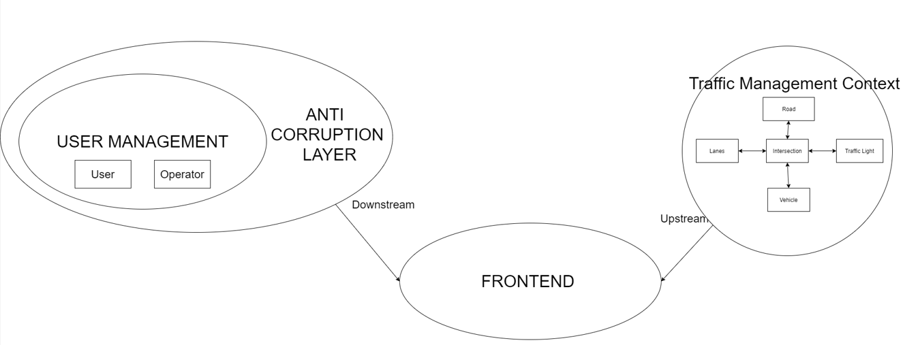

# Italian Traffic Management System

## Explaining the Premise

As outlined in the project proposal, the objective is to develop an application capable of performing Traffic Management, referred to as TMS or Traffic Management System. The focus is on mimicking and simulating how a system would handle traffic at intersections, based on Italian driving laws. Specifically, the goal is to influence the timing of Traffic Lights based on the number of cars present at each intersection.

The domain for this application encompasses traffic, driving laws, conventions, and habits of land drivers. It's important to note that "Traffic Management" in this context specifically refers to the management of ground vehicle traffic, as opposed to Naval and Air traffic, which are separate domains.

## Knowledge Crunching by Event Storming

Knowledge Crunching was executed using an Event Storming methodology, facilitated by the Miro tool. The process involved the collaborative gathering of ideas and knowledge on the topic. Each team member acquired information independently before coming together to consolidate their insights on the domain.

Miro simplified this process by enabling the construction of a Mind Map. This map contained key concepts related to the project's environment. Using words and connecting them, hierarchies of concepts were formed to enhance the understanding of the domain.

# Knowledge Crunching: Ubiquitous Language and Requirements Analysis

## Forming Ubiquitous Language

After constructing the Mind Map, we established a Ubiquitous Language for the domain. This language serves as a detailed glossary for names and concepts used throughout the project. Key terms include:

- **Intersections:** Location where roads meet, featuring Traffic Lights for traffic management.
- **Vehicle/Standard Vehicle:** Autonomous road entity traveling on Lanes.
- **Emergency Vehicle:** Vehicle with priority in lane travel.
- **Lane/s:** Road segments for vehicle travel.
- **Vehicles on Lanes (VoL):** Concept denoting the number of Vehicles on a Lane at a given time.
- **Monitoring:** Users observe Intersection states, including Traffic Lights and Lanes.
- **Manually Operating Intersections (MOI):** Operators control Traffic Lights at Intersections.
- **Traffic Lights:** Control Intersection flow with Red, Yellow, and Green states.
- **Driver:** Entity logging into the system and capable of Monitoring.
- **Operator:** User with advanced privileges capable of MOI.
- **Priority:** Privilege for certain Vehicles due to travel nature.

## Requirements Analysis

The Requirements Analysis, stemming from Knowledge Crunching, details high-level functional requirements for the project. The Traffic Management System aims to:

- Manage autonomous Traffic Lights at intersections to optimize traffic flow.
- Feature a front-end for Users to observe Intersection states and manually control Traffic Lights.
- Allow Traffic Lights to operate automatically, making decisions based on the number of vehicles in each lane.
- Track the number of lanes, vehicles in each lane (with vehicle type), and Traffic Light states for each Intersection.
- Enable Operators to manually override Traffic Light operation.
- Automatically manage traffic based on predetermined or changeable configurations.
- Determine prioritization of lanes based on vehicle count and Emergency Vehicles.

## Additional Development Tasks

- **Integration of Continuous Integration via GitHub Action**
- **Extension of Initial Part on Domain-Driven Design (DDD)**
- **Integration of Continuous Delivery via Gradle**
  - Include Gradle files in each microservice (hierarchy).
  - Develop specific tasks for each microservice type (e.g., build all and clean all).

## Containerization

- Develop Docker images for each microservice.
- Create a Docker-compose file grouping containers and defining dependencies.

## Context Map

  
  

[Go Back.](./index.md)
