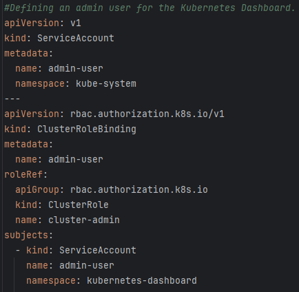
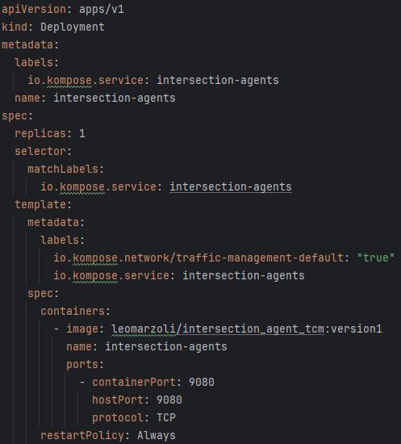
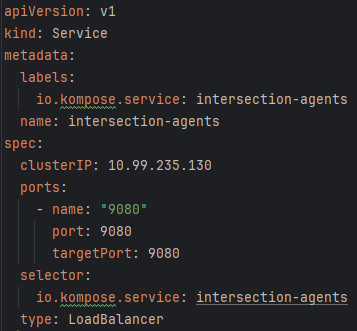
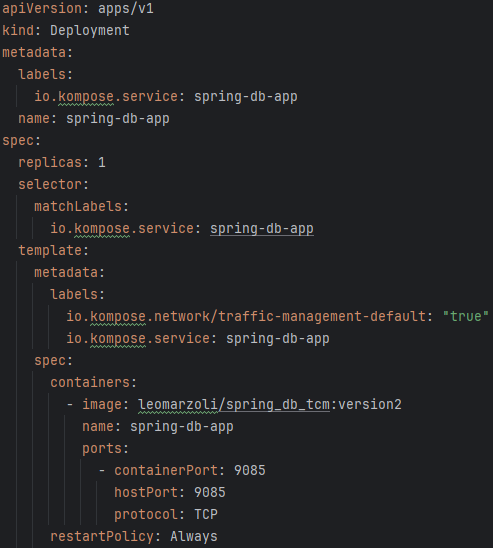
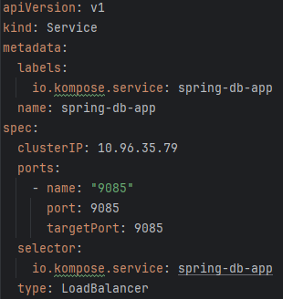
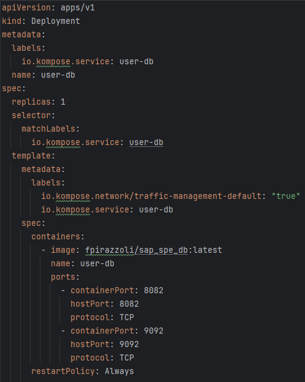
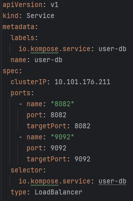
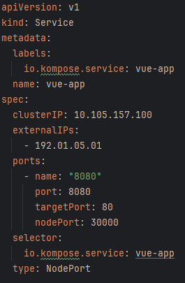

# Kubernetes Orchestration

In the journey of orchestrating services with Kubernetes, several components and configurations have been implemented to ensure seamless functionality within the cluster. Let's delve into the key aspects of the Kubernetes setup.

## Metrics Server Deployment

To enhance monitoring capabilities, the Metrics Server has been integrated into the Kubernetes cluster. This server facilitates the collection and retrieval of crucial metrics related to pods and nodes. The following components into the `components.yaml` contribute to this deployment:

- **Service Account:** `metrics-server-service-account.yaml`
- **Cluster Roles:** `metrics-server-cluster-roles.yaml`
- **Role Binding:** `metrics-server-role-binding.yaml`
- **Service:** `metrics-server-service.yaml`
- **Deployment:** `metrics-server-deployment.yaml`

These files collectively establish the Metrics Server, granting it the necessary permissions to access metrics and ensuring its availability within the `kube-system` namespace.

## Kubernetes Dashboard Admin User

For managing the Kubernetes Dashboard effectively, an admin user has been defined. The files `dashboard-service-account.yaml` and `dashboard-cluster-role-binding.yaml` create a service account and establish the necessary role bindings, enabling the admin-user service account to assume the `cluster-admin` role. This ensures privileged access to the Kubernetes Dashboard.

  

## Intersection Agents Deployment

The deployment of intersection agents involves creating a Kubernetes Deployment and Service for the `intersection-agents` microservice. The following files are involved:

- **Deployment:** `intersection-agents-deployment.yaml`
- **Service:** `intersection-agents-service.yaml`

These files deploy and expose the `intersection-agents` microservice within the Kubernetes cluster, paving the way for effective traffic management simulations.

  
  

## Spring Database Application Deployment

The Spring database application, a crucial component of the system, is orchestrated using Kubernetes. The files `spring-db-app-deployment.yaml` and `spring-db-app-service.yaml` manage the deployment and service aspects, ensuring seamless communication and accessibility.

  
  

## User Database Deployment

The User database, based on the SAP SPE, is deployed using Kubernetes resources. The files `user-db-deployment.yaml` and `user-db-service.yaml` govern the deployment and service configurations, facilitating user data management within the cluster.

  
  

## Vue Application Deployment

The frontend Vue.js application is deployed and exposed using Kubernetes resources. The files `vue-app-deployment.yaml` and `vue-app-service.yaml` dictate the deployment and service configurations, allowing users to interact with the system through the Vue.js application.

  
  

## Cluster Overview

The orchestrated components form a cohesive Kubernetes cluster, ensuring the following functionality:

- **Metrics Server:** Monitors and collects metrics related to pods and nodes.
- **Dashboard Admin User:** Empowers administrative access to the Kubernetes Dashboard.
- **Intersection Agents:** Manages traffic simulations and interactions.
- **Spring Database Application:** Handles data storage and retrieval for the Spring application.
- **User Database:** Istanciate a database that can be used to store users' info.
- **Vue Application:** Facilitates user interaction with the system through the Vue.js frontend.

This orchestrated Kubernetes environment provides a robust foundation for the Traffic Management System, encompassing monitoring, data storage, and user interaction seamlessly.
